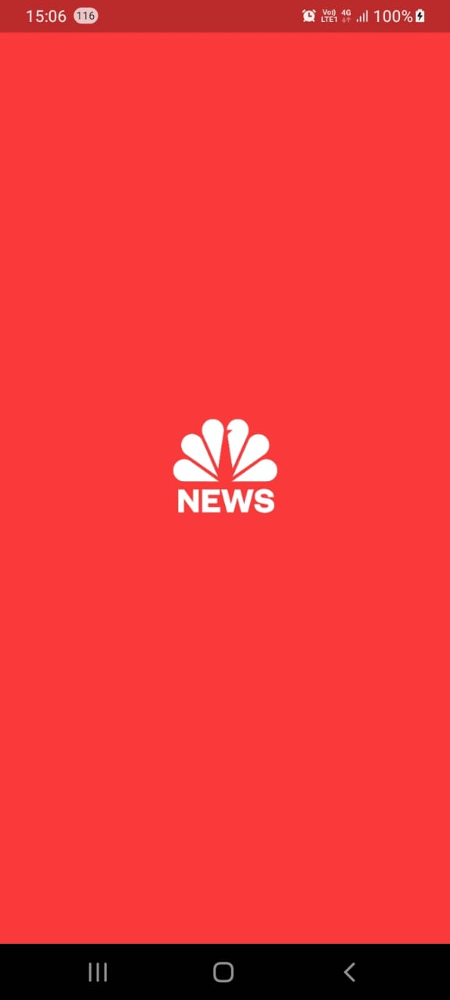
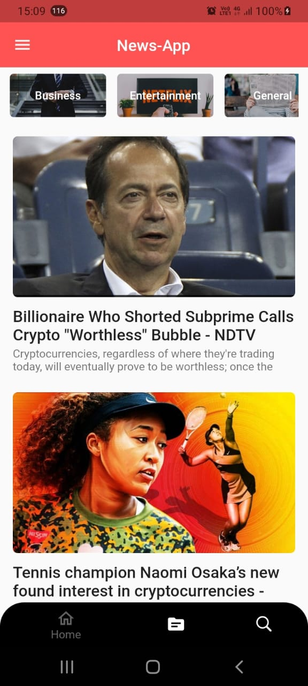
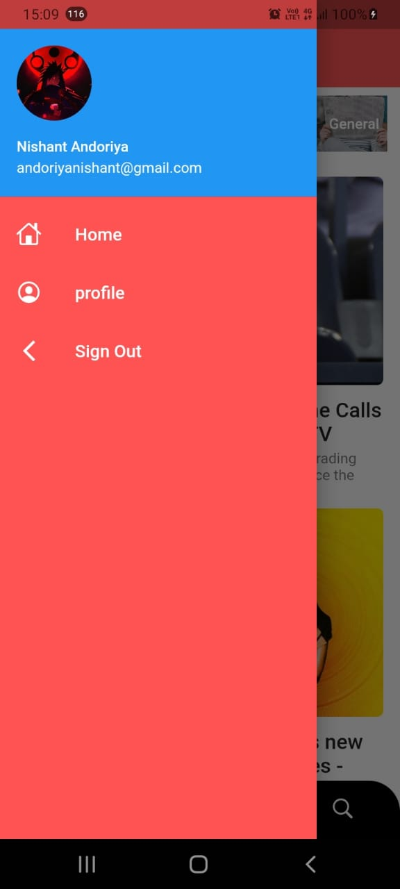
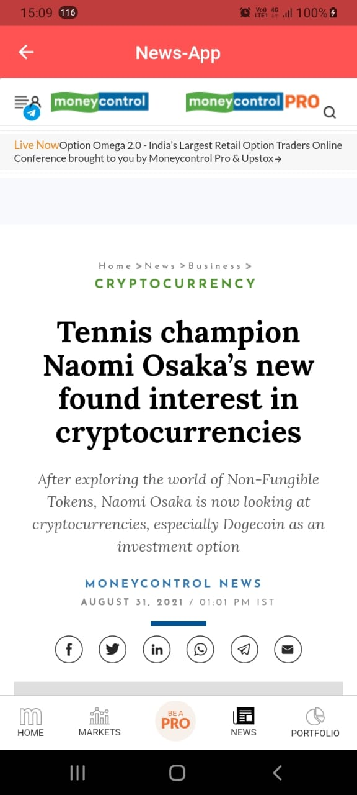
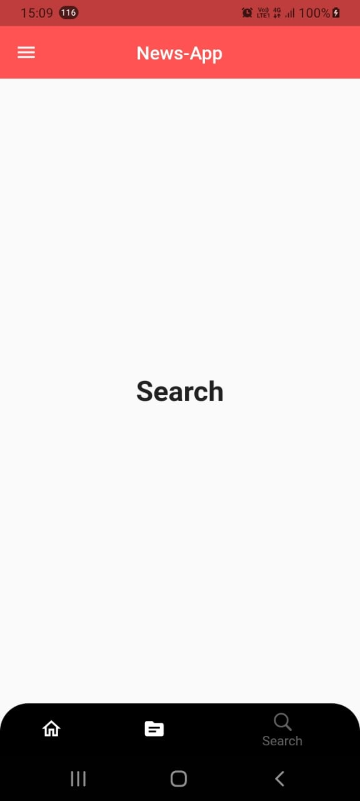

# News App

## Description
 - A news application that fetches the latest news via an API and displays, in a reverse sorted chronological way.

## Features
 - Nativ Splash screen animation
 - Data Fetched from API  (https://newsapi.org/)
 - Null Safe
 - The loading indicator, retry button, and refresh button where ever required.

## Future Implemention
 - Authentication: Email/Password and OAuth.
 - Bookmark items and sync with the cloud database.
 - Search for particular news via keywords.
 - Add support for supplying multiple API keys so that if the quota is exhausted on one, it automatically uses the next available key.

 ## ⚡Screenshots

 

    </img>
    </img>
    </img> 
     
    </img> 
    </img>
    </img>
      

 

## 💻Tech Stack

- Flutter
- Firebase

 

 